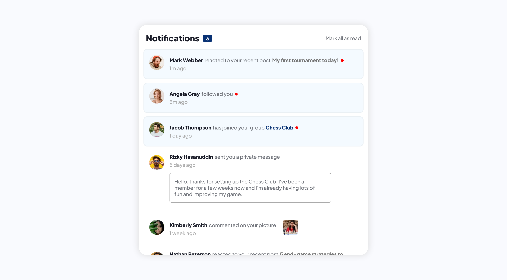

# Frontend Mentor - Notifications page solution

This is a solution to the [Notifications page challenge on Frontend Mentor](https://www.frontendmentor.io/challenges/notifications-page-DqK5QAmKbC).

## Table of contents

- [Overview](#overview)
  - [The challenge](#the-challenge)
  - [Screenshot](#screenshot)
  - [Links](#links)
- [My process](#my-process)
  - [Built with](#built-with)
  - [What I learned](#what-i-learned)
  - [Continued development](#continued-development)
  - [Useful resources](#useful-resources)
- [Author](#author)
- [Acknowledgments](#acknowledgments)

**Note: Delete this note and update the table of contents based on what sections you keep.**

## Overview

### The challenge

Users should be able to:

- Distinguish between "unread" and "read" notifications
- Select "Mark all as read" to toggle the visual state of the unread notifications and set the number of unread messages to zero
- View the optimal layout for the interface depending on their device's screen size
- See hover and focus states for all interactive elements on the page

### Screenshot

### Links

- Solution URL: [Add solution URL here](https://your-solution-url.com)
- Live Site URL: [https://kamilkwk12.github.io/Notifications-page/](https://kamilkwk12.github.io/Notifications-page/)

## My process
  In this project, I was using mobile-first workflow for the first time ever, and this type of workflow simplifies process of creating responsive site. Firstly, I've created mobile design with all of the CSS styles connected. Then, I've defined @media breakpoint which defines where is starting mobile type of website and where desktop version, then styled it properly with only few selectors. JS code is simple but in my opinion effective. I leave that one up to you to judge.
### Built with

- Semantic HTML5 markup
- CSS custom properties
- Flexbox
- Mobile-first workflow
- JavaScript code

### What I learned

I've learned how to create really good responsive site with a brakepoint and two diffrent versions of the same website. Also I'm proud of my clean and simple JS code.

## Author

- Frontend Mentor - [@@Kamilkwk12](https://www.frontendmentor.io/profile/Kamilkwk12)

